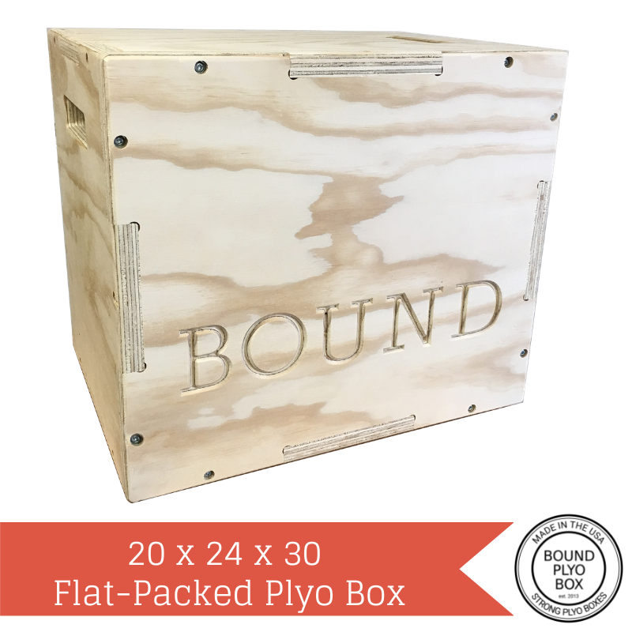

  <button>
    <a
      href="https://smile.amazon.com/Bound-Plyo-Box-Puzzle-Plyometric/dp/B013VSTQYS/ref=sr_1_9?s=sporting-goods&ie=UTF8&qid=1516749208&sr=1-9&keywords=plyo+box"
      target="\_blank"
      rel="noopener noreferrer"
      style={{
        color: 'black',
        textDecoration: 'none',
        fontSize: 40,
        textAlign: 'center'
      }}
      title="Purchase Bound Plyo Box on Amazon"
    >
      Purchase on Amazon
    </a>
  </button>

 

 

 

 

 

 

 

 

 
